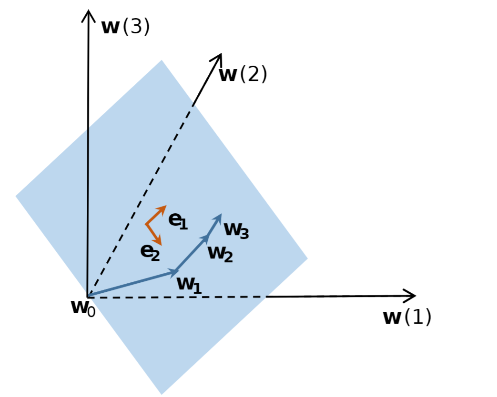

# Dynamic Linear Dimensionality Reduction

This repository is the official implementation of **Low Dimensional Trajectory Hypothesis is True: DNNs can be Trained in Tiny Subspaces** (TPAMI 2022).

## Abstract

Deep neural networks (DNNs) usually contain massive parameters, but there is redundancy such that it is guessed that they could be trained in low-dimensional subspaces. In this paper, we propose a Dynamic Linear Dimensionality Reduction (DLDR) based on the low-dimensional properties of the training trajectory. The reduction method is efficient, supported by comprehensive experiments: optimizing DNNs in 40-dimensional spaces can achieve comparable performance as regular training over thousands or even millions of parameters. Since there are only a few variables to optimize, we develop an efficient quasi-Newton-based algorithm, obtain robustness to label noise, and improve the performance of well-trained models, which are \changedtext{three} follow-up experiments that can show the advantages of finding such low-dimensional subspaces.



<!--  -->

## Requirements

The environment requires:

+ python 3.6
+ pytorch 1.4.0
+ CUDA Version 10.0.130

## Usage

We provide training examples in `run.sh` (take CIFAR experiments for example):

```bash
# CIFAR experiments
# Label noise levels
c=0.2
datasets=CIFAR10
for model in resnet20
do
    CUDA_VISIBLE_DEVICES=0 python -u train_sgd.py --datasets $datasets --lr 0.1 --corrupt $c --arch=$model --epochs=150  --save-dir=save_labelnoise$c\_$model |& tee -a log_$model
    
    CUDA_VISIBLE_DEVICES=0 python -u train_pbfgs.py --epochs 20 --datasets $datasets --corrupt $c --params_start 0 --params_end 81  --batch-size 1024   --n_components 40 --arch=$model  --save-dir=save_labelnoise$c\_$model |& tee -a log_$model 

    CUDA_VISIBLE_DEVICES=0 python -u train_psgd.py --epochs 40 --datasets $datasets --lr 1 --corrupt $c --params_start 0 --params_end 81  --batch-size 128  --n_components 40 --arch=$model  --save-dir=save_labelnoise$c\_$model |& tee -a log_$model 
done
```

1. enter directory

   ```bash
   $ cd DLDR
   ```
   
2. run the demo

   ```bash
   $ ./run.sh
   
   ```

Specifically, the demo consists of two steps:


The first step is to perform DLDR sampling with regular training (e.g. SGD):

```bash
$ CUDA_VISIBLE_DEVICES=0 python -u train_sgd.py --datasets $datasets --lr 0.1 --corrupt $c --arch=$model --epochs=200  --save-dir=save_labelnoise$c\_$model |& tee -a log_$model
```

We can set `randomseed` and total training epochs `epochs` . By default, we sample the model parameters after each epoch training.

The second step is to conduct training in the subspaces extracted by DLDR (from the same initalization):

```bash
$ CUDA_VISIBLE_DEVICES=0 python -u train_pbfgs.py --epochs 20 --datasets $datasets --corrupt $c --params_start 0 --params_end 81  --batch-size 1024   --n_components 40 --arch=$model  --save-dir=save_labelnoise$c\_$model |& tee -a log_$model 
```
where `epochs`  is the total number of training epochs for the P-BFGS algorithm, `params_start` is the index where DLDR sampling begins and `params_end` is where DLDR sampling stops. `n_components` is the number of variables we extract.

The `datasets` can be chosen from CIFAR10/CIFAR100/ImageNet. The percentage of corrupted data `c` is a real number in the range `[0, 1]`.


## Citation

```bash 
@article{li2022low, \
  title={Low Dimensional Trajectory Hypothesis is True: DNNs can be Trained in Tiny Subspaces}, \
  author={Li, Tao and Tan, Lei and Huang, Zhehao and Tao, Qinghua and Liu, Yipeng and Huang, Xiaolin}, \
  journal={IEEE Transactions on Pattern Analysis and Machine Intelligence}, \
  year={2022}, \
  publisher={IEEE} \
}
```